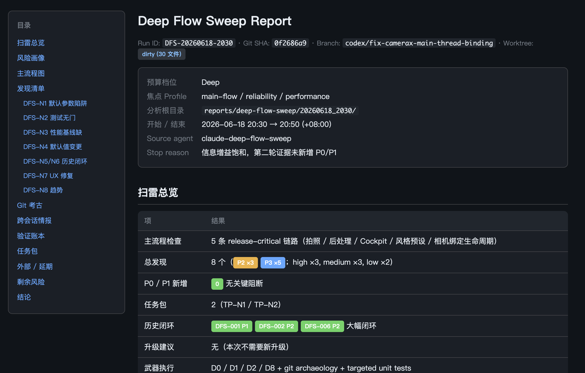
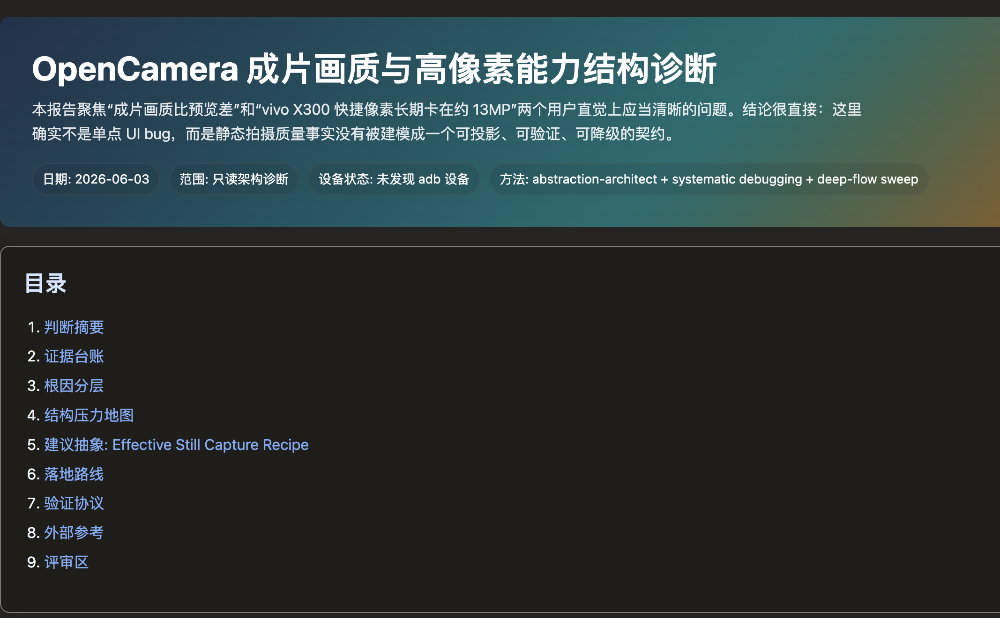

# Teotis Skills

Architecture and execution skills for agents that need to reason before they
change things.

These skills are built for engineering work where "just edit the code" is the
wrong first move: architecture pressure, legacy renewal, release-critical risk,
dense technical reports, and multi-agent execution plans. They help an agent
turn a messy codebase into evidence, choices, reports, and safe next steps.

[Chinese version](README.zh-CN.md)

## The Short Version

Use Teotis Skills when you want an agent to:

- find the real structural pressure instead of naming a fashionable pattern;
- separate code ugliness from business-critical compatibility;
- audit important flows before deciding what to fix;
- produce reports a human can review, not just walls of chat text;
- coordinate multi-agent work with ledgers, package boundaries, and final verification.

The default stance is conservative: analysis before mutation, evidence before
claims, and explicit handoff before implementation.

## Why These Skills Exist

Coding agents make local changes quickly. That speed is useful, but it also
makes certain failures more expensive:

| Failure mode | What usually goes wrong | Teotis response |
|---|---|---|
| The architecture diagnosis is too shallow | The agent sees repeated code and invents an abstraction before proving the invariant. | `abstraction-architect` forces baseline deletion, candidate competition, counterexamples, and evidence-backed structure. |
| Legacy modernization turns into theater | The agent proposes a migration route without proving adoption cost, rollback, or stability floor. | `renewal-architect` converts modernization into reversible pilots and decision gates. |
| The release risk is hiding in real flows | The agent reviews files but misses main-flow failures, stale tests, observability gaps, and historical loops. | `deep-flow-sweep` maps flows, risks, evidence, and follow-up task packages before fixes begin. |
| The report is hard to review | The conclusion is trapped in a long chat transcript or a flat Markdown dump. | `reviewable-html-report` provides browser-readable HTML mechanics: TOC, diagrams, cards, feedback, and export. |
| Multi-agent work loses the plot | Background agents finish in different states and no artifact owns the truth. | `agent-orchestration-planner` creates package prompts, DAG state, event ledgers, and final integration contracts. |

## Report Surfaces

The skills are designed to produce artifacts that are easier to inspect than raw
chat: a clear opening verdict, navigable structure, evidence tables, risk
labels, and review sections that help a human decide what to trust next.





## Skill Portfolio

### [`abstraction-architect`](abstraction-architect/)

For structural architecture analysis when complexity may come from missing
invariants, duplicated domain models, unstable boundaries, conversion chains,
platform branching, or scattered process state.

- **Design goal:** discover structural models that can delete families of
  adapters, modes, projections, and workflow drift.
- **Expected effect:** a reviewable architecture report with pressure maps,
  proposal IDs, admissibility checks, rejected candidates, unknowns, and a
  transition handoff.
- **Use when:** you suspect the codebase is fighting a missing invariant rather
  than merely needing local cleanup.

### [`renewal-architect`](renewal-architect/)

For legacy systems and long-running technical debt where the hard part is not
only the target design, but how to move without breaking the business.

- **Design goal:** find the dominant constraint and design a reversible first
  breakthrough.
- **Expected effect:** a renewal decision report with fact ledger, stability
  floor, adoption economics, protect/experiment/defer split, and
  pilot-to-decision contract.
- **Use when:** modernization, compatibility, ownership, delivery pressure, and
  rollback all matter at once.

### [`deep-flow-sweep`](deep-flow-sweep/)

For high-budget, analysis-only quality sweeps across main flows, release
surfaces, reliability, tests, observability, security, governance, history, and
follow-up packaging.

- **Design goal:** find where the project can fail in real use before deciding
  what to fix.
- **Expected effect:** a risk map with evidence, severity, coverage debt,
  history loops, validation gaps, and follow-up task packages.
- **Use when:** preparing for a release, large merge, bug bash, architecture
  push, or "what should we fix first?" decision.

### [`reviewable-html-report`](reviewable-html-report/)

For turning an already-formed analysis into a browser-readable artifact.

- **Design goal:** provide reusable HTML mechanics for dense technical reports.
- **Expected effect:** stable sections, Mermaid fallbacks, review cards, local
  feedback, and exportable notes.
- **Use when:** the conclusion exists, but it needs to become a review surface
  rather than a chat transcript.

### [`agent-orchestration-planner`](agent-orchestration-planner/)

For explicit medium-to-large multi-agent execution requests where concurrency
and integration need their own control plane.

- **Design goal:** convert multi-agent work into package boundaries, DAG state,
  event ledgers, and finalization rules.
- **Expected effect:** package prompts, status files, retry/finalize behavior,
  and merge-ready evidence.
- **Use when:** multiple background agents, worktrees, dependencies, and final
  integration must be coordinated deliberately.

## Philosophy

These skills share a few operating beliefs.

**Evidence beats elegance.** A design that cannot name its supporting files,
flows, tests, logs, or constraints is a hypothesis, not a recommendation.

**Good architecture often deletes work.** The first competitor to any new
abstraction is "no new abstraction": delete stale branches, merge local
duplication, improve copy, or keep the current shape when the evidence says it
is stable.

**Legacy systems carry real contracts.** Old code is not automatically wrong.
The question is what must be protected, what can be tested safely, and what
should wait until a pilot produces the missing fact.

**Reports should lower cognitive load.** Dense analysis should open with the
answer, then expose evidence, diagrams, tradeoffs, unknowns, and review controls
in a navigable shape.

**Orchestration needs a truth ledger.** When multiple agents are working, status
must live in explicit artifacts instead of optimistic summaries.

## Quickstart

1. Pick the skill directory you want.
2. Copy that directory into your agent's skills folder, or install this
   repository with a skill installer that supports GitHub sources.
3. Ask for the skill by name in your agent session.

Examples:

```text
Use abstraction-architect on this repo. I want an architecture report, not code changes yet.
```

```text
Run deep-flow-sweep for the release-critical flows and package the top follow-up tasks.
```

```text
Use agent-orchestration-planner to split this migration into background agent packages.
```

Each skill's `SKILL.md` is self-contained. Bundled `references/` and `scripts/`
are included only when the public skill needs them to preserve the portable
core.

## What A Good Run Looks Like

| Output | What to expect |
|---|---|
| Architecture or renewal report | A saved HTML report path, a clickable `file://` URL, named evidence, explicit unknowns, and no code edits unless separately authorized. |
| Deep sweep | A coverage-aware findings list, severity/risk framing, validation gaps, and task packages suitable for follow-up agents. |
| Reviewable HTML | A self-contained report with stable section IDs, readable diagram fallbacks, and feedback/export mechanics. |
| Orchestration kit | `INDEX.md`, package prompts, `package-graph.tsv`, `state.tsv`, `events.jsonl`, package status files, and a finalization contract. |

## Self-Assessment

**Strong at:**

- evidence-first architecture analysis;
- turning vague engineering unease into reviewable artifacts;
- separating analysis, pilot design, execution, and handoff;
- preserving human control in agent-heavy work;
- producing reports that are easier to inspect than raw chat.

**Not optimized for:**

- quick one-line bug fixes;
- tasks where immediate implementation is already obvious;
- replacing project-specific tests, telemetry, or product judgment;
- hiding uncertainty behind confident prose.

**Maturity note:** these skills are opinionated and practical, but still evolving.
They work best when you treat them as reusable engineering disciplines, inspect
their outputs critically, and adapt them to your own team's vocabulary.

## License

Apache License 2.0. See [LICENSE](LICENSE).
